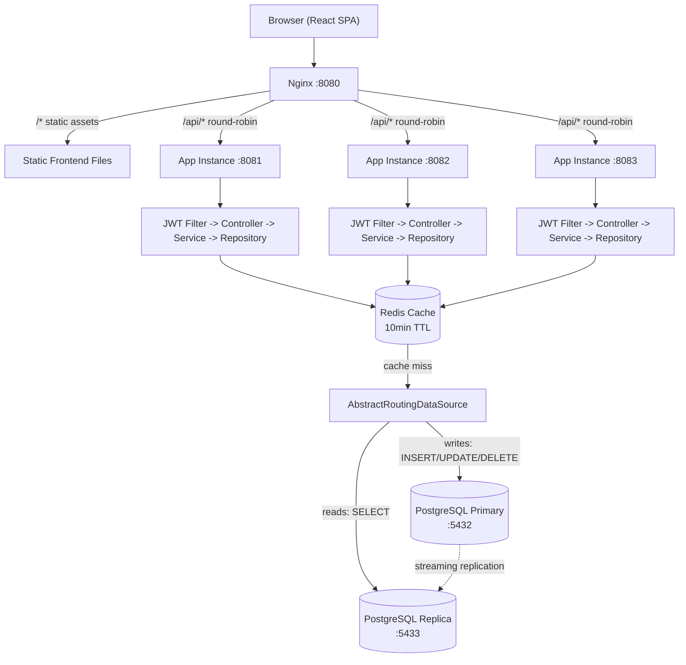

# 🌸 BloomsCafe

**A full-stack cafe e-commerce platform demonstrating production-grade backend architecture** — read/write DB splitting, distributed caching, horizontal scaling, and JWT-secured REST APIs, with a customer storefront and admin management panel.

---

## Table of Contents

- [Overview](#overview)
- [Tech Stack](#tech-stack)
- [Architecture](#architecture)
- [Technical Highlights](#technical-highlights)
- [Features](#features)
- [Routes](#routes)
- [API Reference](#api-reference)
- [Project Structure](#project-structure)
- [Getting Started](#getting-started)
- [Scripts](#scripts)

---

## Overview

BloomsCafe is a two-sided platform: a customer storefront for browsing the menu, managing a cart, and placing orders, and an admin panel for managing products, categories, orders, and users. It's built as a realistic multi-instance deployment rather than a single monolith demo — three Spring Boot instances sit behind an Nginx load balancer, backed by a PostgreSQL primary/replica pair and a shared Redis cache.

## Tech Stack

| Layer | Technology |
|-------|-----------|
| **Frontend** | React 18, TypeScript, Tailwind CSS 3, Zustand, React Router 6, Axios, Vite 5 |
| **Backend** | Java 21, Spring Boot 3.2, Spring Security, Spring Data JPA, Spring Cache |
| **Database** | PostgreSQL (primary + read replica) |
| **Caching** | Redis |
| **Auth** | JWT (jjwt) |
| **Proxy** | Nginx (reverse proxy, load balancing) |
| **Build** | Maven (backend), Vite (frontend) |

## Architecture

The system follows a layered architecture with five tiers.



**1. Client Layer** — A React SPA served as static files. The browser loads the app from the server, then communicates with the backend via REST API calls. Zustand manages client-side state (auth session, cart). Axios handles HTTP with a JWT interceptor that attaches the token to every authenticated request.

**2. Load Balancer** — Nginx runs on port 8080 and serves two purposes: it delivers static frontend assets directly, and it reverse-proxies `/api/*` requests to the application cluster using round-robin load balancing across three backend instances on ports 8081, 8082, and 8083.

**3. Application Layer** — Each Spring Boot instance follows a linear request pipeline:
- **JWT Filter** intercepts every request, validates the token, and sets the security context
- **Controller** parses the HTTP request and delegates to the service layer
- **Service** contains business logic, applies `@Transactional` boundaries, and coordinates cache and data access
- **Repository** (Spring Data JPA) executes database queries with `JOIN FETCH` to prevent N+1 issues

**4. Caching Layer** — Redis is shared across all app instances. Products and categories are cached with a 10-minute TTL. Caches are invalidated on any create, update, or delete operation.

**5. Data Layer** — PostgreSQL with a primary-replica setup. The `DataSourceConfig` uses `AbstractRoutingDataSource` to automatically route write operations (`INSERT`, `UPDATE`, `DELETE`) to the primary on port 5432 and read-only queries (`SELECT`) to the replica on port 5433. The replica stays in sync via streaming replication.

## Technical Highlights

A quick summary of the systems-level decisions worth noting:

| Concern | Implementation |
|---------|---------------|
| **Horizontal scaling** | Nginx round-robin across 3+ Spring Boot instances — `make run3` |
| **Caching strategy** | Redis caches products/categories with a 10-minute TTL, invalidated on writes |
| **Read/write splitting** | `AbstractRoutingDataSource` routes reads to the replica, writes to the primary; `LazyConnectionDataSourceProxy` defers connection acquisition until the routing decision is known |
| **N+1 query prevention** | All repositories use `JOIN FETCH` and batch fetching — see `docs/(N+1)QUERY.md` |
| **Stateless auth** | JWT validated per-request in a servlet filter, ahead of the controller layer |

## Features

### Customer
- Browse menu by product categories
- Add items to cart (persisted server-side)
- Place orders and track order status
- Register / login with JWT authentication

### Admin
- Dashboard with key metrics
- Manage products (CRUD)
- Manage categories (CRUD)
- View and update order statuses
- User management

## Routes

**Public** — `/` Home, `/login`, `/register`, `/menu` (browse products), `/cart`, `/my-orders`

**Admin** — `/admin` Dashboard, `/admin/products`, `/admin/categories`, `/admin/orders`, `/admin/users`

## API Reference

| Endpoint | Method | Description | Auth |
|----------|--------|-------------|------|
| `/api/auth/register` | POST | Register new user | No |
| `/api/auth/login` | POST | Login, returns JWT | No |
| `/api/products` | GET | List all products | No |
| `/api/products/{id}` | GET | Get product by ID | No |
| `/api/categories` | GET | List categories | No |
| `/api/cart` | GET | Get user's cart | JWT |
| `/api/cart/add` | POST | Add item to cart | JWT |
| `/api/cart/remove` | DELETE | Remove from cart | JWT |
| `/api/orders` | GET | List user's orders | JWT |
| `/api/orders` | POST | Place order | JWT |
| `/api/admin/products` | GET/POST/PUT/DELETE | Manage products | Admin |
| `/api/admin/categories` | GET/POST/PUT/DELETE | Manage categories | Admin |
| `/api/admin/orders` | GET/PUT | Manage orders | Admin |
| `/api/admin/users` | GET | Manage users | Admin |

## Project Structure

```
BloomsCafe/
├── src/main/java/com/bloomscafe/
│   ├── BloomsCafeApplication.java    # Entry point
│   ├── DataSeeder.java               # Seeds initial data
│   ├── config/                       # DataSource, Redis, port config
│   │   ├── DataSourceConfig.java     # Primary + replica routing
│   │   ├── RedisConfig.java          # Cache manager setup
│   │   └── ServerPortFilter.java
│   ├── controller/                   # REST endpoints
│   │   ├── AuthController.java
│   │   ├── CartController.java
│   │   ├── CategoryController.java
│   │   ├── OrderController.java
│   │   ├── ProductController.java
│   │   └── UserController.java
│   ├── dto/                          # Request/response objects
│   ├── entity/                       # JPA models
│   │   ├── User.java, Role.java
│   │   ├── Product.java, Category.java
│   │   ├── Cart.java, CartItem.java
│   │   └── Order.java, OrderItem.java, OrderStatus.java
│   ├── exception/                    # Global error handling
│   ├── repository/                   # Spring Data JPA interfaces
│   ├── security/                     # JWT filter, util, config
│   │   ├── JwtUtil.java
│   │   ├── JwtAuthenticationFilter.java
│   │   ├── SecurityConfig.java
│   │   └── CustomUserDetailsService.java
│   └── service/                      # Business logic
│       ├── AuthService.java
│       ├── CartService.java
│       ├── CategoryService.java
│       ├── OrderService.java
│       ├── ProductService.java
│       └── UserService.java
├── src/main/resources/
│   └── application.properties        # DB, Redis, JWT config
│
├── frontend/
│   ├── src/
│   │   ├── api/                      # Axios client + API modules
│   │   ├── components/
│   │   │   ├── layout/               # Navbar, Footer, PublicLayout
│   │   │   └── ui/                   # Pagination
│   │   ├── pages/
│   │   │   ├── Home.tsx              # Landing page
│   │   │   ├── Login.tsx, Register.tsx
│   │   │   ├── Menu.tsx, Cart.tsx, MyOrders.tsx
│   │   │   └── admin/                # Admin panel pages
│   │   ├── store/                    # Zustand (authStore, cartStore)
│   │   ├── router/index.tsx          # Route definitions
│   │   ├── types/index.ts            # TypeScript interfaces
│   │   └── utils/jwt.ts              # JWT helpers
│   ├── index.html
│   ├── vite.config.ts                # Dev proxy :3000 → :8080
│   └── package.json
│
├── config/nginx-bloomscafe.conf      # Nginx upstream config
├── docs/(N+1)QUERY.md                # N+1 fix documentation
├── Makefile                          # run3 / stop targets
├── pom.xml                           # Maven build
└── .gitignore
```

## Getting Started

### Prerequisites
- Java 21+, Maven
- Node.js 18+
- PostgreSQL (ports 5432 primary, 5433 replica)
- Redis (port 6379)

### Backend

```bash
./mvnw spring-boot:run
```

Runs on `http://localhost:8080`. Configure DB, Redis, and JWT credentials in `src/main/resources/application.properties`.

### Frontend

```bash
cd frontend
npm install
npm run dev
```

Runs on `http://localhost:3000`. Vite proxies `/api` to `:8080`.

### Production mode

```bash
make run3   # Builds JAR, starts 3 instances on :8081/:8082/:8083, configures nginx on :8080
make stop   # Kills all instances
```

## Scripts

| Command | Description |
|---------|-------------|
| `npm run dev` | Start Vite dev server |
| `npm run build` | `tsc -b && vite build` |
| `npm run preview` | Preview production build |
| `npm run lint` | ESLint check |
| `./mvnw spring-boot:run` | Run backend |
| `make run3` | Production: 3 instances + nginx |
| `make stop` | Stop all backend processes |