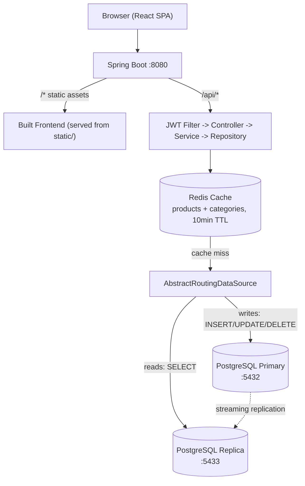

# 🌸 BloomsCafe

**A full-stack cafe e-commerce platform demonstrating production-grade backend architecture** — read/write DB splitting, Redis caching, and JWT-secured REST APIs, served as a single Spring Boot instance with a React storefront and admin panel.

---

## Table of Contents

- [Overview](#overview)
- [Tech Stack](#tech-stack)
- [Architecture](#architecture)
- [Technical Highlights](#technical-highlights)
- [Features](#features)
- [Routes](#routes)
- [API Reference](#api-reference)
- [Performance & Load Testing](#performance--load-testing)
- [Project Structure](#project-structure)
- [Getting Started](#getting-started)
- [Scripts](#scripts)

---

## Overview

BloomsCafe is a two-sided platform: a customer storefront for browsing the menu, managing a cart, and placing orders, and an admin panel for managing products, categories, orders, and users.

One Spring Boot instance on port 8080 serves both the REST API and the built React frontend, backed by a PostgreSQL primary/replica pair (writes → primary, reads → replica) and a Redis cache that absorbs the read load.

## Tech Stack

| Layer | Technology |
|-------|-----------|
| **Frontend** | React 18, TypeScript, Tailwind CSS 3, Zustand, React Router 6, Axios, Vite 5 |
| **Backend** | Java 21, Spring Boot 3.2, Spring Security, Spring Data JPA, Spring Cache |
| **Database** | PostgreSQL (primary + streaming read replica) |
| **Caching** | Redis (10-min TTL) |
| **Auth** | JWT (jjwt, 24h expiry) |
| **Build** | Maven (backend), Vite (frontend) |
| **Load testing** | k6 |

## Architecture


```mermaid
flowchart TD
    Browser["Browser (React SPA)"] --> App["Spring Boot :8080"]

    App -->|"/* static assets"| Static["Built Frontend (served from static/)"]
    App -->|"/api/*"| JWT["JWT Filter -> Controller -> Service -> Repository"]

    JWT --> Redis[("Redis Cache\nproducts + categories, 10min TTL")]
    Redis -->|cache miss| Router["AbstractRoutingDataSource"]
    Router -->|writes: INSERT/UPDATE/DELETE| Primary[("PostgreSQL Primary\n:5432")]
    Router -->|reads: SELECT| Replica[("PostgreSQL Replica\n:5433")]
    Primary -.->|streaming replication| Replica
```

**1. Client Layer** — A React SPA built with Vite. The build output is copied into `src/main/resources/static` and served by Spring Boot itself, so the entire application runs on a single port. Zustand manages client-side state (auth session, cart); Axios attaches the JWT to every authenticated request.

**2. Application Layer** — A single Spring Boot instance on :8080:
- **JWT Filter** intercepts every request, validates the token, sets the security context
- **Controller** parses HTTP requests and delegates to the service layer
- **Service** holds business logic, `@Transactional` boundaries, and cache coordination
- **Repository** (Spring Data JPA) uses `JOIN FETCH` everywhere to prevent N+1 queries

**3. Caching Layer** — Redis caches product reads (list, by-category, by-id) and category reads with a 10-minute TTL. Any product or category write evicts the relevant caches immediately, so the DB only sees cache misses.

**4. Data Layer** — PostgreSQL primary/replica. `AbstractRoutingDataSource` routes writes to the primary (:5432) and read-only transactions to the replica (:5433), which stays in sync via streaming replication. `LazyConnectionDataSourceProxy` defers connection acquisition until the routing decision is known.

## Technical Highlights

| Concern | Implementation |
|---------|---------------|
| **Single-port deployment** | One instance serves API + frontend — `make run` |
| **Caching strategy** | Products (list/page/by-id) and categories cached in Redis, 10-min TTL, write-through eviction; serializable DTO (`ProductPageResponse`) avoids `PageImpl` Redis round-trip issues |
| **Stock safety** | Order stock decrements use pessimistic row locks (`SELECT ... FOR UPDATE` via `findAllByIdForUpdate`) — no oversell under concurrent orders |
| **Read/write splitting** | Reads → replica, writes → primary via `AbstractRoutingDataSource` |
| **N+1 query prevention** | `JOIN FETCH` on all list/detail queries — see `docs/(N+1)QUERY.md` |
| **Stateless auth** | JWT validated per-request in a servlet filter |
| **SPA deep links** | `SpaForwardController` forwards client routes (`/login`, `/admin/...`) to `index.html` |

## Features

### Customer
- Browse the menu by category
- Add items to a server-persisted cart
- Place orders and track order status
- Register / login with JWT auth

### Admin
- Dashboard with key metrics
- Product CRUD
- Category CRUD
- Order status management
- User management

## Routes

**Public** — `/` Home, `/login`, `/register`, `/menu`, `/cart`, `/my-orders`

**Admin** — `/admin` Dashboard, `/admin/products`, `/admin/categories`, `/admin/orders`, `/admin/users`

## API Reference

| Endpoint | Method | Description | Auth |
|----------|--------|-------------|------|
| `/api/auth/register` | POST | Register new user | No |
| `/api/auth/login` | POST | Login, returns JWT | No |
| `/api/products` | GET | List products (paginated, cached) | No |
| `/api/products/{id}` | GET | Get product by ID (cached) | No |
| `/api/products/category/{id}` | GET | Products by category (paginated, cached) | No |
| `/api/categories` | GET | List categories (cached) | No |
| `/api/cart` | GET | Get user's cart | JWT |
| `/api/cart/items` | POST | Add item to cart | JWT |
| `/api/cart/items/{productId}` | PUT | Update item quantity | JWT |
| `/api/cart/items/{productId}` | DELETE | Remove item | JWT |
| `/api/cart` | DELETE | Clear cart | JWT |
| `/api/orders` | GET | All orders | Admin |
| `/api/orders` | POST | Place order (body optional → from cart) | JWT |
| `/api/orders/my-orders` | GET | Current user's orders | JWT |
| `/api/orders/{id}/status` | PUT | Update order status | Admin |
| `/api/products` | POST/PUT/DELETE | Product management | Admin |
| `/api/categories` | POST/PUT/DELETE | Category management | Admin |
| `/api/users` | GET | User list | Admin |

## Performance & Load Testing

Load tests are run with [k6](https://k6.io/) against the running instance on :8080.

**Scripts**

| Script | Description |
|--------|-------------|
| `capacity-test.js` | Full e2e flow: login + browse + cart + order + history. Parametrized with `-e VUS` / `-e DUR` |
| `docs/LOAD-TEST-REPORT-SINGLE-INSTANCE.md` | Full report, methodology, and 3-instance comparison |

```bash
k6 run capacity-test.js                        # 100 VUs, 30s
k6 run -e VUS=500 -e DUR=60s capacity-test.js  # custom load
```

**Measured capacity (single instance)**

*Cached reads — `GET /api/products` only:*

| VUs | p(95) | Throughput | Errors |
|-----|-------|-----------|--------|
| 500 | 59 ms | ~13,500 req/s | 0% |
| 1000 | 113 ms | ~12,900 req/s | 0% |
| 5000 | 1.12 s | ~6,300 req/s | 0% |

*Full e2e flow (writes hit PostgreSQL):*

| VUs | p(95) | Throughput | Errors |
|-----|-------|-----------|--------|
| 100 | 108 ms | 240 req/s | 0% |
| 300 | 274 ms | 624 req/s | 0% |
| 400 | 415 ms | 754 req/s | 0% |
| 500 | 826 ms | 874 req/s | 0% |
| 700 | 1.54 s | 979 req/s | 0% (max pass) |
| 800 | 2.18 s | 983 req/s | FAIL (latency) |

**Takeaways**
- **~1000 VUs** of catalog traffic is comfortable (sub-115 ms p95); **~400 VUs** for the full order flow
- Throughput saturates at ~980 req/s for e2e — the PostgreSQL write path is the bottleneck
- Product caching shifted the read path entirely to Redis (~13k req/s, DB untouched)

See `docs/LOAD-TEST-REPORT-SINGLE-INSTANCE.md` for the full methodology and 3-instance comparison, and `docs/DB-OPTIMIZATION-REPORT.md` for the bottleneck analysis and fixes (product caching ✅, stock locking ✅).

## Project Structure

```
BloomsCafe/
├── src/main/java/com/bloomscafe/
│   ├── BloomsCafeApplication.java    # Entry point
│   ├── DataSeeder.java               # Seeds users/categories/products
│   ├── config/
│   │   ├── DataSourceConfig.java     # Primary + replica routing
│   │   └── RedisConfig.java          # Cache manager (10min TTL)
│   ├── controller/
│   │   ├── AuthController.java
│   │   ├── CartController.java
│   │   ├── CategoryController.java
│   │   ├── OrderController.java
│   │   ├── ProductController.java
│   │   ├── SpaForwardController.java # SPA deep-link fallback → index.html
│   │   └── UserController.java
│   ├── dto/                          # Request/response objects
│   │   └── ProductPageResponse.java  # Serializable page DTO for Redis cache
│   ├── entity/                       # JPA models (User, Product, Cart, Order, ...)
│   ├── exception/                    # Global error handling
│   ├── repository/                   # Spring Data JPA (JOIN FETCH queries)
│   ├── security/                     # JwtUtil, JwtAuthenticationFilter, SecurityConfig
│   └── service/                      # Business logic + @Cacheable / @CacheEvict
├── src/main/resources/
│   ├── application.properties        # DB, Redis, JWT config
│   └── static/                       # Built frontend (gitignored)
│
├── frontend/
│   ├── src/
│   │   ├── api/                      # Axios client + API modules
│   │   ├── components/               # layout/ + ui/
│   │   ├── pages/                    # Home, Login, Menu, Cart, MyOrders, admin/
│   │   ├── store/                    # Zustand (authStore, cartStore)
│   │   ├── router/index.tsx          # Route definitions
│   │   └── types/index.ts            # TypeScript interfaces
│   ├── vite.config.ts                # Dev proxy :3000 → :8080
│   └── package.json
│
├── capacity-test.js                  # k6 e2e capacity test
├── docs/
│   ├── (N+1)QUERY.md                 # N+1 fix documentation
│   ├── LOAD-TEST-REPORT-SINGLE-INSTANCE.md  # Load test report
│   └── DB-OPTIMIZATION-REPORT.md     # DB bottleneck analysis + fixes
├── Makefile                          # build / run / stop targets
├── pom.xml                           # Maven build
└── .gitignore
```

## Getting Started

### Prerequisites
- Java 21+, Maven
- Node.js 18+
- PostgreSQL on :5432 (primary) and :5433 (replica, streaming from primary)
- Redis on :6379

### Development

Backend:

```bash
./mvnw spring-boot:run
```

Runs on `http://localhost:8080`. DB, Redis, and JWT settings live in `src/main/resources/application.properties` (JWT secret in `jwt.secret` — replace in production).

Frontend:

```bash
cd frontend
npm install
npm run dev
```

Runs on `http://localhost:3000`; Vite proxies `/api` to `:8080`.

### Production

```bash
make run     # Builds frontend → static/, packages JAR, starts one instance on :8080
make stop    # Kills the instance
```

## Scripts

| Command | Description |
|---------|-------------|
| `npm run dev` | Vite dev server (:3000) |
| `npm run build` | `tsc -b && vite build` |
| `npm run preview` | Preview production build |
| `npm run lint` | ESLint check |
| `./mvnw spring-boot:run` | Run backend |
| `make build` | Build frontend into `static/` + JAR |
| `make run` | Production: build + single instance on :8080 |
| `make stop` | Stop the backend process |
| `k6 run capacity-test.js` | E2E load test |
